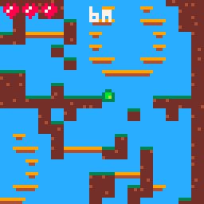

# portfolio

## escalator world (aug 2020)

<iframe width="560" height="315" src="https://www.youtube-nocookie.com/embed/suoa5GiEE6o" frameborder="0" allow="accelerometer; autoplay; clipboard-write; encrypted-media; gyroscope; picture-in-picture" allowfullscreen></iframe>

### how do I run it?

Play online [here](https://pancelor.itch.io/escalator-world).

### what is it?

This was an exercise in really really polishing up all of the non-gameplay parts of a game. I think of it as the [coinstar monologue](https://youtu.be/w20iz92QUco), but for videogames :)

Based on an old game maker game back in the yoyogames era called "Escalator World" by LeGuy. It's one of my favorites; one of the few I made sure to download before the yoyogames forums were lost to time...

(well, you can apparently get the games from the forums at <www.archive.org> somewhere, but it was more complication than I was willing to deal with last time I tried)

Oh, this was also my first time writing game music!

## necrodecorator (july 2020)

<iframe width="560" height="315" src="https://www.youtube-nocookie.com/embed/O1a1a4KAaHk" frameborder="0" allow="accelerometer; autoplay; clipboard-write; encrypted-media; gyroscope; picture-in-picture" allowfullscreen></iframe>

### how do I run it?

Play online [here](https://pancelor.itch.io/necrodecorator).

### what is it?

A game about decorating an inn to make the denizens from [Crypt of the NecroDancer](https://braceyourselfgames.com/crypt-of-the-necrodancer/) feel cozy when they visit. Made for a 7-day game jam with [cryss](https://www.twitter.com/princryss); I did all the code and cryss did all of the art/sound.

This was a really fun project that taught me a lot about scoping a game, and how difficult even the most basic 3D stuff can be. (the game is hardly 3D but I spent most of my time making the objects render in the correct order)

## software renderer (sep 2020)

<iframe width="560" height="315" src="https://www.youtube-nocookie.com/embed/XfQZR6Vfens" frameborder="0" allow="accelerometer; autoplay; clipboard-write; encrypted-media; gyroscope; picture-in-picture" allowfullscreen></iframe>

(with music from [The Smurfs' Nightmare](https://www.youtube.com/watch?list=PLFAB3E682EBF46BDB&v=Z4lqyFcEn3Q))

### how do I run it?

Ah, I haven't published the code for this online anywhere yet. But you can check out this [twitter thread](https://twitter.com/pancelor/status/1307774529565896705) showing my step-by-step progress, from individual triangles all the way up to a lit 3D scene.

### what is it?

This is a 3D renderer that doesn't use the GPU at all; it does all the triangle math manually on the CPU and individually sets the color of each pixel shown onscreen. This was a fun experience learning a bit about how 3D graphics work. I only use "fast" operations while rasterizing the triangles (i.e. no floating-point division).

I looked up [how to draw 2D lines](https://en.wikipedia.org/wiki/Bresenham%27s_line_algorithm) but had to figure out the rest on my own.

The teapot is made of 3752 triangles / 1976 vertices, and the renderer runs at around 5ms per frame. I haven't done the research to figure out how good that really is (and I haven't attempted to optimize the renderer, beyond my "fast math" design restrictions) but I can spin this particular teapot around at 60fps with plenty of time to spare :)

## puzzlescript level select (july 2020)

<iframe width="560" height="315" src="https://www.youtube-nocookie.com/embed/rg0t26K9egw" frameborder="0" allow="accelerometer; autoplay; clipboard-write; encrypted-media; gyroscope; picture-in-picture" allowfullscreen></iframe>

### how do I run it?

Play [this game](https://thinkycollective.itch.io/dr-jelly-and-mr-slime) to see it in action. (I did not make this game, I just wrote the forked level-select-enabled engine that the authors used)

To use it in your own game, clone the [github repo](https://github.com/pancelor/PuzzleScript/tree/level-select), and follow the instructions for running the project locally.

### what is it?

The [PuzzleScript engine](https://www.puzzlescript.net/) is an existing tool that I did not write. I've made a few games in it, and I wanted to add a level select screen to my games. I've seen this done in various ways but never found them completely satisfying, so I edited the code for the puzzlescript engine itself and added level select capabilities.

I'm very happy with the result! I think it blends into the existing engine pretty seamlessly, from a player's perspective.

## upgo (aug 2020)

### how do I run it?

Play online [here](https://pancelor.itch.io/upgo).

### what is it?

Made over 2 weeks for [lowrezjam 2020](https://itch.io/jam/lowrezjam-2020). An exercise in making a platformer with "good game feel" (coyote frames, automatic x-adjustment when hitting the edge of an overhang, queued jump inputs, etc)

This was my first time doing procgen, I think? That was a fun learning experience. I basically re-implemented Spelunky's level generation by following this excellent [explanation](http://tinysubversions.com/spelunkyGen/). Also, I feel like a switch has flipped in my brain about coordinate systems - there is no "correct" way to do coordinates; you just interpret some numbers however you want.

I wish I had spent more time making this into a real game - there's some good platformer feel and some decent level generation, but the game overall isn't very gripping. I would have liked to have added some powerups or items or something.

## hexringer (mar 2020)

<iframe width="560" height="315" src="https://www.youtube-nocookie.com/embed/nd7OK5OZI4o" frameborder="0" allow="accelerometer; autoplay; clipboard-write; encrypted-media; gyroscope; picture-in-picture" allowfullscreen></iframe>

### how do I run it?

Play online [here](https://pancelor.itch.io/hexringer)

### what is it?

A recreation (with a twist!) of a boss from Crypt of the NecroDancer. Made for a 1-day long game jam. I just like this boss and wanted to see how hard it would be to recreate. Also, I wanted to see how hard/fun it would be to fight Dead Ringer on a hexagonal grid.

I'm surprised that this went as smoothly as it did. I scraped together some html game code from another game I'm making, so writing the game engine wasn't much of a hurdle, but I'm surprised the first thing I tried for enemy AI actually worked.

## worms PICO-8 tweetcart (aug 2020)

<blockquote class="twitter-tweet" data-dnt="true">
had fun today makin a little <a href="https://twitter.com/hashtag/pico8?src=hash&amp;ref_src=twsrc%5Etfw">#pico8</a> <a href="https://twitter.com/hashtag/tweetcart?src=hash&amp;ref_src=twsrc%5Etfw">#tweetcart</a>:  pal({11,2,140,136,135,129,1,138,130,143,139,3,7,128,142},1) t=0 e=128 cls(6) ::e:: t+=1 for c=0,15 do d=c*21%16*2 fillp(65&lt;&lt;(t/7%4)) circfill(64+64*sin(t/64+c/16),(t+9*d)%(e+d)+(d^^3)/2*sin(c*t/e),d/2,c) end flip() goto e <a href="https://t.co/arEqT4TTQv">pic.twitter.com/arEqT4TTQv</a>
&mdash; pancelor (@pancelor) <a href="https://twitter.com/pancelor/status/1298093163878391808?ref_src=twsrc%5Etfw">August 25, 2020</a></blockquote> 

### how do I run it?

Copy the code from [the tweet](https://twitter.com/pancelor/status/1298093163878391808) into your pico-8 console and run it.

### what is it?

A fun little animation, written as a pico-8 cartridge that fits inside a tweet.

## GameJamDOR (mar 2020, july 2020)

I've organized and run 2 gamejams:

* <https://itch.io/jam/gamejamdor>
* <https://itch.io/jam/gamejamdor2>

These were both Crypt of the NecroDancer-themed game jams and were wildly successful by my metric: other people besides me joined and had a good time :)
Both had about 6 submissions.

A video of me playing all games from GJD2 in a call with the creators: <https://www.twitch.tv/videos/691855470?t=00h04m39s>

## skewdence mod (for Crypt of the NecroDancer) (apr 2017)

[Gameplay video](https://www.twitch.tv/videos/696751030?t=00h09m53s)

### how do I run it?

Download [the mod](https://steamcommunity.com/sharedfiles/filedetails/?id=905808003) and run it

### what is it?

Normally in this game, you move in the 4 orthogonal directions.
I made a mod where you can only move in 4 directions... but 4 weird directions (N, NE, S, and SW), which makes the game completely different and very fun, in a mind-expanding/headache sort of way.

---

[back to homepage](index.html)
